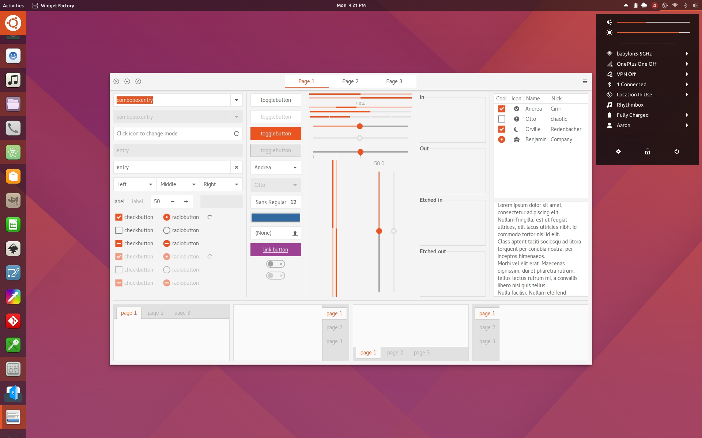
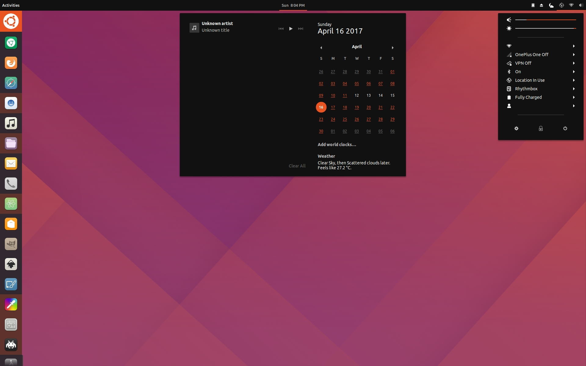
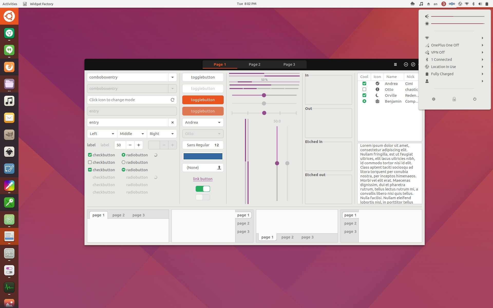

United GNOME
=========
Based on a Ubuntu 18.04 design concept with some inspiration from Unity 8. Works with and tested on both GNOME 3.24 and 3.22 using Ubuntu GNOME 17.04 and Fedora respectively. The theme will most likely work with 3.20 as well but expect a couple small issues.

Features
--------
- Shell theme: transparent dark, opaque dark and opaque light.
- GTK3 theme: light, dark and light with a dark titlebar similar to Unity 8.
- Supports [Dash to Dock](https://github.com/micheleg/dash-to-dock) with modifications made to make it resemble the Unity 7/8 launcher.

Requirements
------------
- GTK+ 3.20 or later
- `gnome-themes-standard`
- pixmap (or pixbuf) engine
- murrine engine

##### Supported desktop environments are:
- GNOME Shell 3.22 and later

Installation
------------
Compiled versions are uploaded onto gnome-look.org at https://www.gnome-look.org/p/1174889/
An install script hasn't been written yet but there is a compile script that lets you make some changes and compile every variant.

Contributing
------------
Please let me know of any bugs or quirks. Any contribution would be much appreciated. If you want to make your own tweaks, the compile.sh script compiles and transfers everything over to their appropriate folders which are all compressed in the Compiled archive file. All that's to it is extacting that folder, making your changes in the src folder and then running the script.

License
-------
This is distributed under the terms of the GNU General Public License, version 3 or later. See the [`LICENSE.md`](LICENSE.md) file for details.

Credits
-------
- The original creator of Flat-Plat: https://github.com/nana-4/Flat-Plat/
- The original creator of Arc: https://github.com/horst3180/arc-theme
- The original concept by Jovan Petrovic: https://dribbble.com/shots/3429458-Ubuntu-Gnome-Concept
- The included symbolic icons are based on [Material Design icons](https://github.com/google/material-design-icons) by Google.

Preview
-------
## Preview

