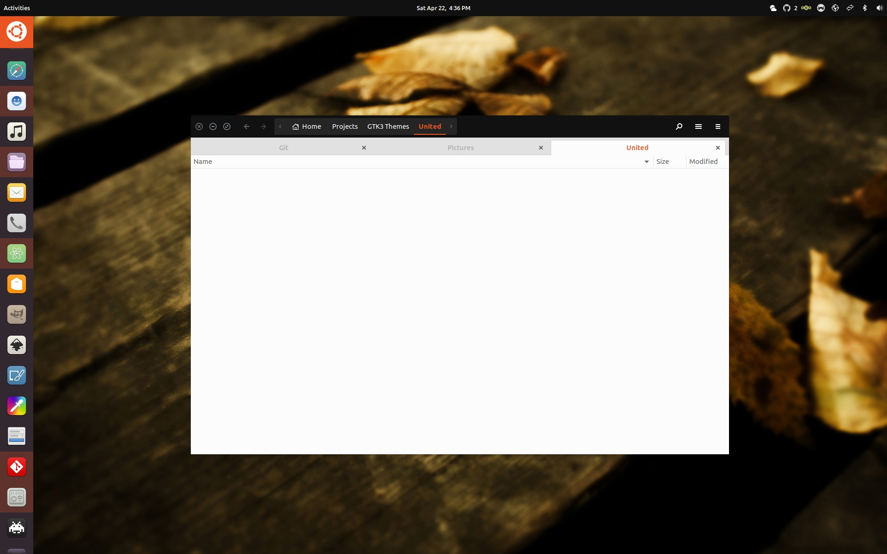
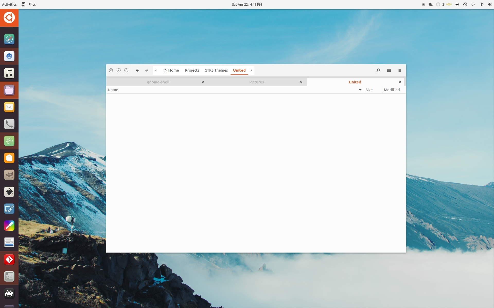

United GNOME
=========
Based on a Ubuntu 18.04 design concept using Flat-Plat as a base. Made on and for GNOME 3.24 (Ubuntu), tested and works fine on 3.22 (Fedora). Most likely will work with 3.20 and up. Support for 3.18 and other DEs is currently unknown.

Features
--------
- Supports both light and dark variants.
- Supports dark or light titlebar versions.
- Supports compact version for low resolution. (GNOME Shell)
- Supports [Dash to Dock](https://github.com/micheleg/dash-to-dock) extension's theming.

Requirements
------------
- GTK+ 3.20 or later
- `gnome-themes-standard`
- pixmap (or pixbuf) engine
- murrine engine

##### Supported desktop environments are:
- GNOME Shell 3.20 and later
- You tell me

Installation
------------
Compiled versions are uploaded onto gnome-look.org at https://www.gnome-look.org/p/1174889/
An install script hasn't been written yet.

Contributing
------------
Please let me know of any bugs or quirks. Any contribution would be much appreciated.

Roadmap 
----------------
- Support other DEs
- Move over to Arc theme's (ideally custom) assets.
- Fix the LibreOffice button issue

License
-------
This is distributed under the terms of the GNU General Public License, version 2 or later. See the [`COPYING`](COPYING) file for details.

Credits
-------
- The original creator of Flat-Plat: https://github.com/nana-4/Flat-Plat/
- The original creator of Arc: https://github.com/horst3180/arc-theme
- The original concept by Jovan Petrovic: https://dribbble.com/shots/3429458-Ubuntu-Gnome-Concept
- The included symbolic icons are based on [Material Design icons](https://github.com/google/material-design-icons) by Google.

Preview
-------
## Preview

